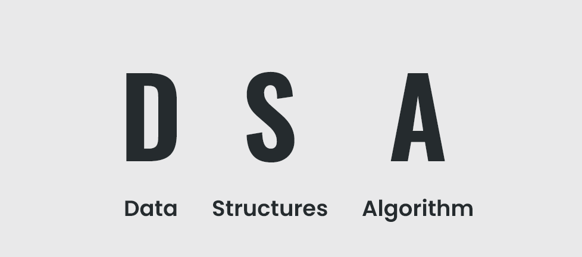
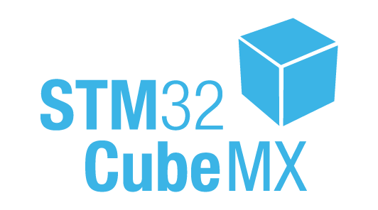

# CDAC-PG-DESD 

## [Module - 1](/C_Program) C Programming  

## [Module - 2](/Data_Structure) Data Structures and Algorithms  
1. [Stack](../Doubly_Link_List)
2. [Queue](../Doubly_Link_List)
3. [Link List](../Doubly_Link_List)
4. [Doubly Link List](../Doubly_Link_List)
5. [Binary Tree](../Doubly_Link_List)
6. [Sorting Algorithms](../Doubly_Link_List)

## [Module - 3](/Microcontroller_Programming_&_Interfacing) Microcontroller Programming and Interfacing
1. [GPIO](/Microcontroller_Programming_&_Interfacing/GPIO)
2. [DMA](/Microcontroller_Programming_&_Interfacing/GPIO)
