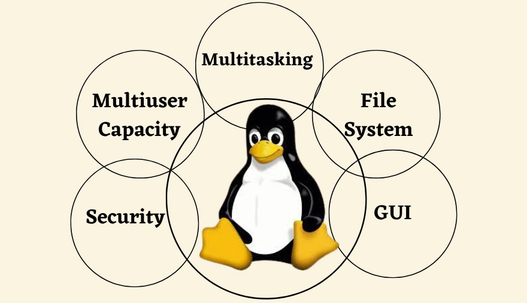

# CDAC-PG-DESD 

## [Module - 1](/C_Program) C Programming  

## [Module - 2](/Data_Structure/readme.md) Data Structures and Algorithms  
### 1. [Stack](/Data_Structure/readme.md)
### 2. [Queue](/Data_Structure/readme.md)
### 3. [Link List](/Data_Structure/readme.md)
### 4. [Doubly Link List](/Data_Structure/readme.md)
### 5. [Binary Tree](/Data_Structure/readme.md)
### 6. [Sorting Algorithms](/Data_Structure/readme.md) 

## [Module - 3](/Microcontroller_Programming_&_Interfacing/readme.md) Microcontroller Programming and Interfacing
### 1. [GPIO](/Microcontroller_Programming_&_Interfacing/readme.md)
### 2. [DMA](/Microcontroller_Programming_&_Interfacing/readme.md)
### 3. [INTERRUPTS](/Microcontroller_Programming_&_Interfacing/readme.md)
### 4. [ADC](/Microcontroller_Programming_&_Interfacing/readme.md)
### 5. [LOW_POWER_MODES](/Microcontroller_Programming_&_Interfacing/readme.md)
### 6. [SENSORS](/Microcontroller_Programming_&_Interfacing/readme.md)
### 7. [UART_PROTOCOL](/Microcontroller_Programming_&_Interfacing/readme.md)
### 8. [I2C_PROTOCOL](/Microcontroller_Programming_&_Interfacing/readme.md)
### 9. [SPI_PROTOCOL](/Microcontroller_Programming_&_Interfacing/readme.md)
### 10. [TIMERS](/Microcontroller_Programming_&_Interfacing/readme.md)

## [Module - 4](/Operating_System/readme.md) Embeded Operating System
### 1. [LIBRARY](/Operating_System/1_LIBRARY/readme.md)
### 2. [SYSTEM_CALLS](/Operating_System/2_SYS_CALLS_FILES/readme.md)
### 3. [PROCESS](/Operating_System/3_PROCESS/readme.md)
### 4. [THREADS](/Operating_System/4_THREADS/readme.md)
### 5. [MUTEX](/Operating_System/5_MUTEX/readme.md)
### 6. [SEMAHPORE](/Operating_System/6_SEMAPHORE/1_Unnammed_Semaphore/readme.md)
### 7. [THREAD_MODELS](/Operating_System/7_THREAD_MODEL)
### 8. [IPC](/Operating_System/8_IPC/readme.md)
### 9. [SOCKET](/Operating_System/9_SOCKET/readme.md)

## [Module - 5](/Linux_Device_Drivers/readme.md) Linux Device Drivers
### 1. [1_Kernel_Module](/Linux_Device_Drivers/readme.md)
### 1. [2_Kernel_Device_Driver](/Linux_Device_Drivers/readme.md)
